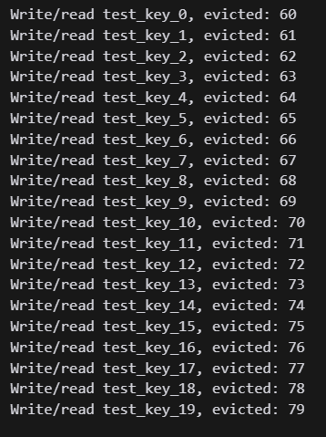

Sequence of evictions doesn't match the sequence of LRU:




### No caching:
```
> docker-compose exec load-test bash /scripts/load_test.sh

{       "transactions":                          300,
        "availability":                       100.00,
        "elapsed_time":                         3.24,
        "data_transferred":                     0.01,
        "response_time":                        1.04,
        "transaction_rate":                    92.59,
        "throughput":                           0.00,
        "concurrency":                         96.20,
        "successful_transactions":               300,
        "failed_transactions":                     0,
        "longest_transaction":                  1.09,
        "shortest_transaction":                 1.00 
}
```

### Caching, no race protection:
```
> docker-compose exec load-test bash /scripts/load_test_cached.sh

{       "transactions":                          300,
        "availability":                       100.00,
        "elapsed_time":                         1.42,
        "data_transferred":                     0.01,
        "response_time":                        0.43,
        "transaction_rate":                   211.27,
        "throughput":                           0.01,
        "concurrency":                         89.82,
        "successful_transactions":               300,
        "failed_transactions":                     0,
        "longest_transaction":                  1.19,
        "shortest_transaction":                 0.03
}
```


### Caching with race protection (https://en.wikipedia.org/wiki/Cache_stampede):
```
> docker-compose exec load-test bash /scripts/load_test_cached.sh

{       "transactions":                          300,
        "availability":                       100.00,
        "elapsed_time":                         1.42,
        "data_transferred":                     0.01,
        "response_time":                        0.43,
        "transaction_rate":                   211.27,
        "throughput":                           0.01,
        "concurrency":                         89.82,
        "successful_transactions":               300,
        "failed_transactions":                     0,
        "longest_transaction":                  1.19,
        "shortest_transaction":                 0.03
}
```

